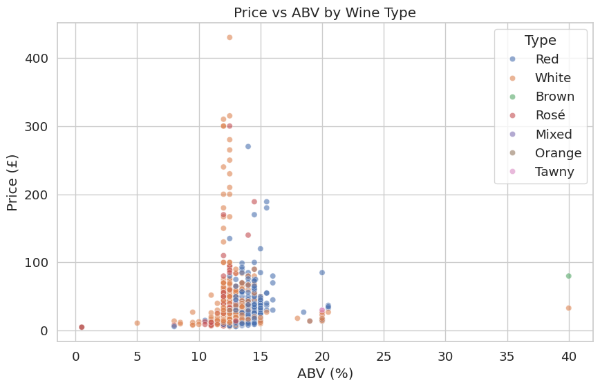
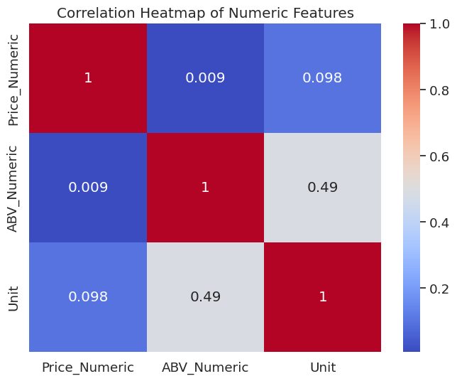
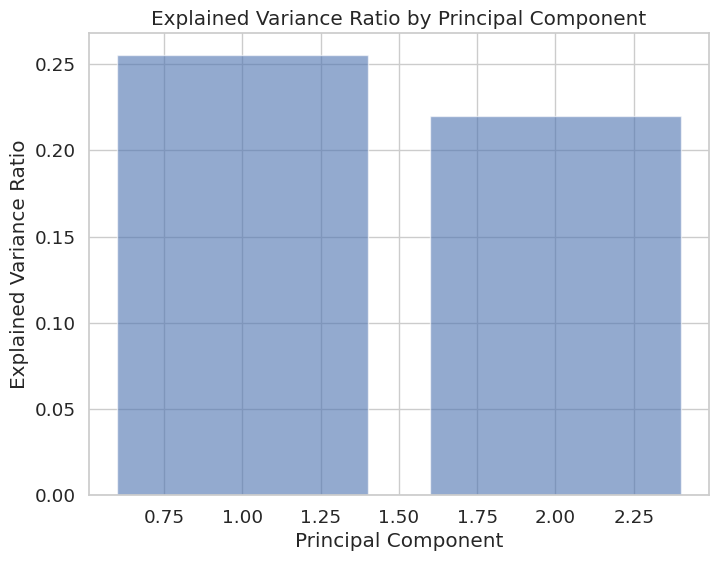
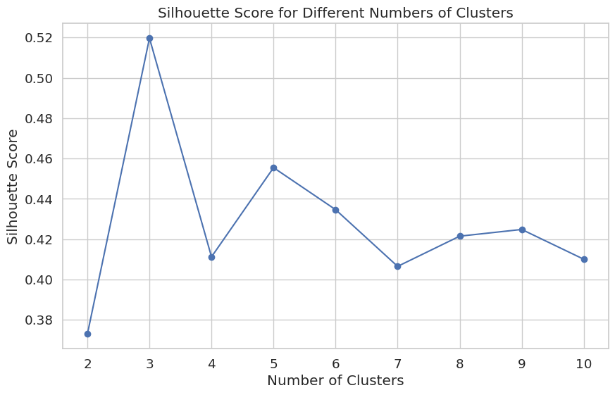
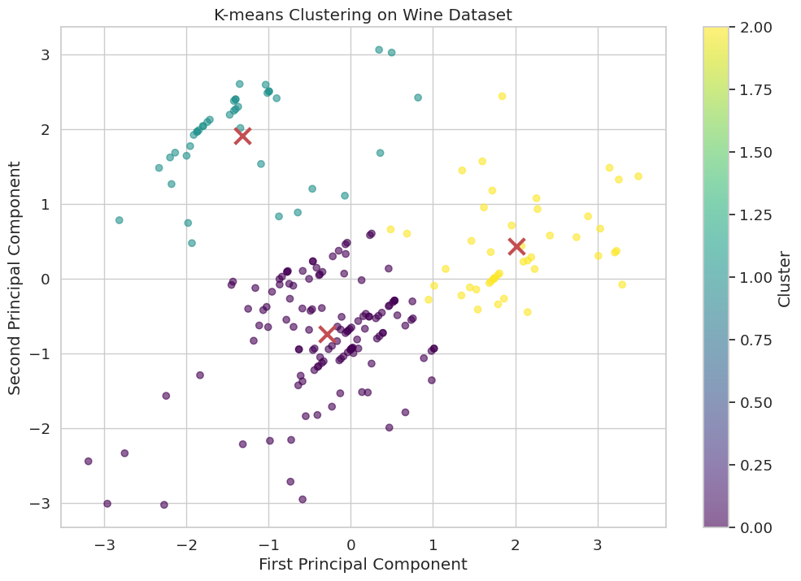
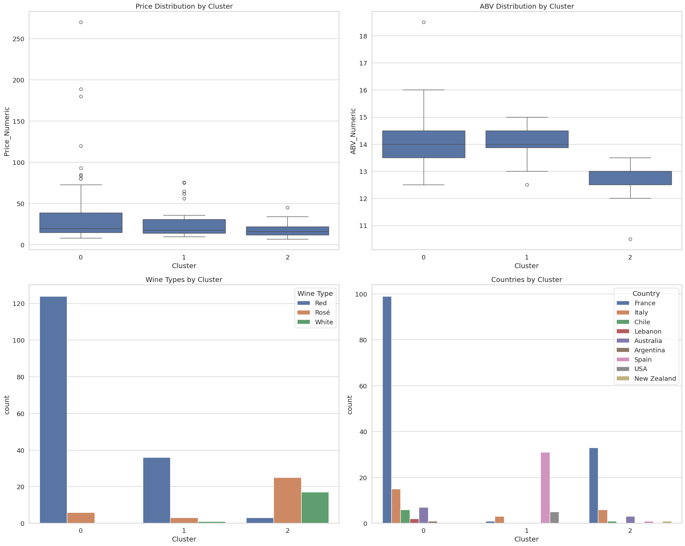
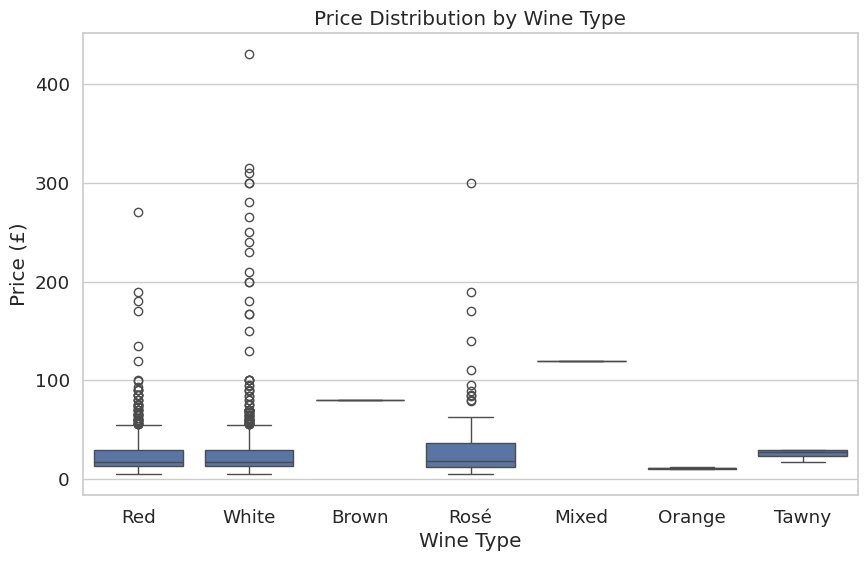
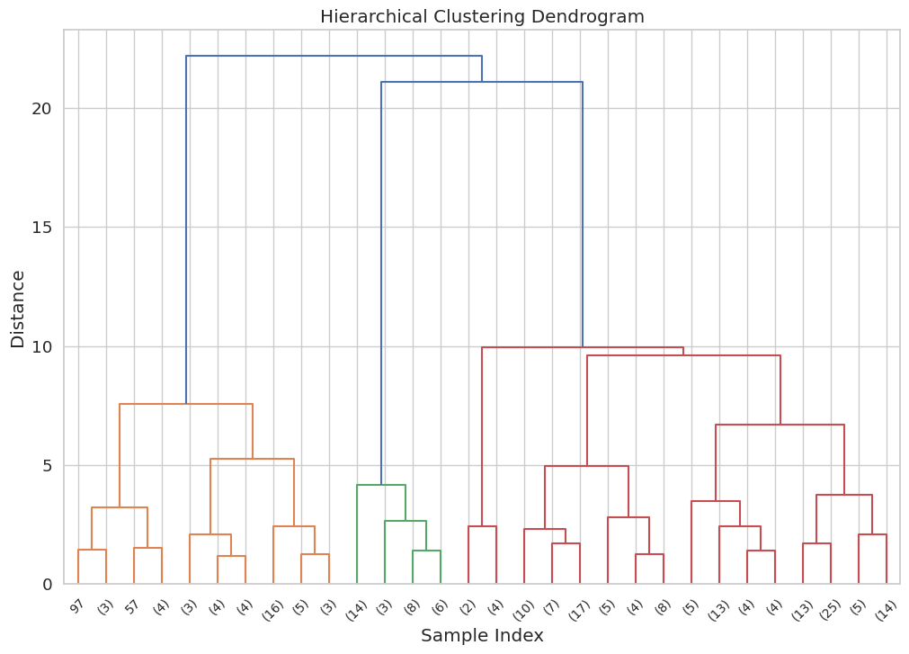

# Wine Segmentation Using Clustering - Comprehensive Report

## Author
Panagiotis Sotirios Georgiadis
- GitHub: [github.com/p-georgiadis](https://github.com/p-georgiadis)
- LinkedIn: [linkedin.com/in/p-georgiadis](https://linkedin.com/in/p-georgiadis)

## Dataset Information
This project uses the Wine Dataset from Kaggle, available at: [https://www.kaggle.com/datasets/elvinrustam/wine-dataset](https://www.kaggle.com/datasets/elvinrustam/wine-dataset)

### About the Dataset
This dataset contains a subset of wines from around the world, providing a comprehensive view of various wine characteristics. The features included are:

- **Title**: The name or title of the wine.
- **Description**: A brief textual description providing additional details about the wine.
- **Price**: The cost of the wine.
- **Capacity**: The volume or size of the wine bottle.
- **Grape**: The primary grape variety used in making the wine.
- **Secondary Grape Varieties**: Additional grape varieties used in the wine blend.
- **Closure**: The type of closure used for the bottle.
- **Country**: The country where the wine is produced.
- **Unit**: Unit of measurement.
- **Characteristics**: The unique and discernible flavors and aromas present in a particular wine.
- **Per bottle / case / each**: The quantity of wine included per unit (bottle, case, or each) sold.
- **Type**: The general category of the wine.
- **ABV**: The percentage of alcohol content in the wine.
- **Region**: The geographic region where the grapes used to make the wine are grown.
- **Style**: This feature describes the overall sensory experience and characteristics of the wine.
- **Vintage**: The year the grapes used to make the wine were harvested.
- **Appellation**: A legally defined and protected geographical indication used to identify where the grapes for a wine were grown.

## Introduction

In the ever-expanding world of wine, the sheer variety of options can be overwhelming for consumers, retailers, and producers alike. With countless combinations of grape varieties, regions, styles, and price points, it has become increasingly challenging to navigate the wine market effectively. This lack of clear segmentation poses difficulties for various stakeholders in the industry. Consumers struggle to find wines that match their preferences, retailers face challenges in optimizing their inventory and marketing strategies, and wineries grapple with positioning their products in a saturated market.

To address these challenges, I embarked on a project to leverage unsupervised learning techniques for wine segmentation. My goal was to identify distinct clusters of wines based on their attributes such as price, grape variety, alcohol by volume (ABV), and style. By uncovering these natural groupings, I aimed to provide valuable insights that could inform decision-making processes across the wine industry.

## Methodology

My approach utilized a combination of exploratory data analysis and machine learning techniques to uncover patterns and segments within the wine dataset. I employed the following methods:

1. **Principal Component Analysis (PCA)**: This dimensionality reduction technique allowed me to visualize the high-dimensional data in a 2D space, making it easier to identify patterns and relationships.

2. **K-means Clustering**: I used this partition-based clustering method to group wines into distinct clusters based on their attributes.

3. **Hierarchical Clustering**: This provided an alternative view of the relationships between wines, allowing me to understand the hierarchical structure of the segments.

The project followed a structured approach, beginning with data preprocessing to handle missing values and encode categorical variables. I then conducted extensive exploratory data analysis to understand the distributions and relationships within the dataset. Following this, I applied PCA for dimensionality reduction and visualization. The core of my analysis involved K-means clustering, which I validated using the Elbow method and Silhouette score to determine the optimal number of clusters.

## Dataset and Exploratory Analysis

I utilized the Wine Dataset provided by Elvin Rustamov on Kaggle, which contains a diverse collection of wines from around the world. The dataset includes various features such as the wine's title, description, price, capacity, grape varieties, closure type, country of origin, ABV, region, style, and vintage.

My initial exploration of the dataset revealed several interesting insights:

As shown in the scatter plot above, I observed that most wines cluster in the 10-15% ABV range. Interestingly, I found that higher ABV doesn't necessarily correlate with higher prices, challenging the common perception that stronger wines are always more expensive. I also noted some outliers, particularly among white wines, with very high prices, likely representing premium or rare varietals.

The correlation heatmap of numeric features provides additional insights into the relationships between various attributes of the wines. This visualization helps me understand which features might be most influential in defining my clusters.

## Dimensionality Reduction and Clustering Analysis

After preprocessing the data, I applied PCA for dimensionality reduction. The variance explained by each principal component is visualized below:

This plot shows the proportion of variance explained by each principal component, helping me determine how many components to retain for my analysis.

To determine the optimal number of clusters, I used both the Elbow method and Silhouette score:

The Silhouette score plot suggests that three clusters provide the best segmentation of the dataset.

Upon applying K-means clustering with three clusters, I uncovered distinct segments in the wine market:

This scatter plot visualizes the results of my K-means clustering, showing how the wines are grouped in the space of the first two principal components.

## Cluster Characteristics

The characteristics of each cluster are summarized in the following visualization:

This plot provides a comprehensive view of how various attributes (such as price, ABV, wine type, and country of origin) are distributed across the three clusters I identified.

Additionally, I can see the price distribution across clusters in more detail:

This box plot clearly shows the difference in price ranges among the three clusters, further supporting my interpretation of premium, mid-range, and budget-friendly segments.

## Hierarchical Clustering

To provide an alternative view of the wine relationships, I also performed hierarchical clustering:

This dendrogram visualizes the hierarchical relationships between wines, offering another perspective on how they group together based on similarity.

## Implications and Recommendations

The insights gained from this clustering analysis have several important implications for various stakeholders in the wine industry:

1. For retailers, this segmentation provides a basis for organizing inventory and creating targeted marketing strategies. They can ensure a balanced representation of wines from each cluster to cater to different customer segments.

2. Wineries and producers can use these insights to position their products effectively. They can identify which cluster their wines fall into and tailor their marketing messages accordingly.

3. For consumers, this segmentation can serve as a guide for exploration. Someone who typically enjoys wines from one cluster might occasionally explore wines from other clusters to broaden their palate.

4. Marketing professionals can develop targeted campaigns for each segment, focusing on the unique characteristics and value propositions of each cluster.

## Conclusion and Future Work

This project demonstrates the power of unsupervised learning techniques in uncovering meaningful patterns within the wine market. By segmenting the market into distinct clusters, I've provided a framework for understanding consumer preferences and market dynamics in the wine industry.

Future work could involve incorporating additional features such as expert ratings, more detailed flavor profiles, or vintage information to create even more nuanced segments. Time-series analysis could uncover trends and seasonal patterns in wine preferences. More advanced clustering techniques or ensemble methods might reveal additional subtleties in market segmentation.

In conclusion, this unsupervised learning approach to wine segmentation provides valuable insights that can inform decision-making across the wine industry. As the market continues to evolve, such data-driven approaches will become increasingly crucial in understanding and responding to consumer preferences and market trends.
